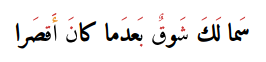

<link rel="preconnect" href="https://fonts.googleapis.com">
<link rel="preconnect" href="https://fonts.gstatic.com" crossorigin>
<link href="https://fonts.googleapis.com/css2?family=Amiri+Quran&display=swap" rel="stylesheet">

<h2 align="center">
حمزة قبادة (Hamza Gbada)

[//]: # (
سÙما Ù„ÙÙƒÙ Ø´Ùوقٌ بÙعدÙما كان٠أÙقصÙرا 
)

</h2>

    

- 👨‍🦱 PhD Student (GNN and CV) [@University of Sousse](https://uso.rnu.tn/).
- 🔭 I am currently working on OCR and Information Extraction.
- 📚 Improving my skill in Graph Neural Networks (GNNs).
- 💌 Open-Source projects.
- شعر, تاريخ, أنساب, رياضيات (Poetry, history, Genealogy, Mathematics).
- 📫 How to reach me: [@LinkedIn](https://www.linkedin.com/in/hamzagbada/)
  

<h2 align="center"> 
  Tech stack 💻
</h2>

<h4 align="left">
  
  Operating System: 
  
  
  
  
</h4>

<h4 align="left">
  
  Programming Languages: 
  
  
  
  
  
</h4>

<h4 align="left">
  
  Librarys & Frameworks: 
  
  
  
  
  
  
  
  
  
  
  
</h4>

<h4 align="left">
    Other Tools:

  
  
  
  
  
  
  
  
  
</h4>

[//]: # (<h4 align="left">)

[//]: # (  )
[//]: # (  Progress : )

[//]: # (  )
[//]: # (  ![Rust]&#40;https://img.shields.io/badge/Rust-black?style=for-the-badge&logo=rust&logoColor=#E57324&#41;)

[//]: # (  ![FLAX]&#40;https://img.shields.io/badge/-FLAX-A8A4A3?style=for-the-badge&logo=JAX&logoColor=white&#41;)

[//]: # (  )
[//]: # (</h4>)
